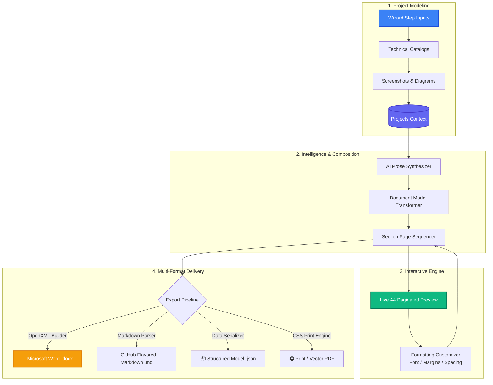

<div align="center">

# 📄 DocuForge AI
### *The Next-Generation Academic & Software Project Documentation Suite*

Turn raw codebases, architectures, schemas, and test cases into publication-grade, university- and IEEE-compliant software documentation in minutes.

<br/>

[](https://react.dev/)
[](https://www.typescriptlang.org/)
[](https://vitejs.dev/)
[](https://tailwindcss.com/)
[](LICENSE)
[](https://github.com/PrincePanara/cerateprojectdoc/pulls)

<br/>

[✨ Highlights](#-highlights) • [🧭 11-Step Wizard](#-the-11-step-engineering-wizard) • [🏗️ Pipeline Architecture](#️-pipeline-architecture) • [📋 Report Blueprint](#-generated-report-blueprint) • [🚀 Quick Start](#-quick-start) • [🛠️ Tech Stack](#️-tech-stack) • [📂 Project Structure](#-project-structure)

</div>

---

> [!TIP]
> **Why DocuForge AI?**  
> Final-year capstones, thesis reports, and enterprise project deliverables typically require dozens of hours of manual styling in Word—fixing margins, aligning tables, numbering figures, formatting certificates, and cross-referencing test cases.  
> **DocuForge AI** replaces this chaos with a structured, step-by-step engineering wizard, real-time A4 paginated preview, and native **Microsoft Word (`.docx`)** output with perfect IEEE and university formatting.

---

## ✨ Highlights

<table>
  <tr>
    <td width="50%">
      <h3>🧙‍♂️ 11-Step Engineering Wizard</h3>
      A systematic, guided journey covering basic credentials, SMART objectives, requirements matrix, architecture diagrams, database schemas, test cases, and screenshot catalogs.
    </td>
    <td width="50%">
      <h3>📄 Native DOCX Export</h3>
      Generates real, styled <code>.docx</code> files via OpenXML with formatted tables, cover pages, certificates, acknowledgements, shaded headers, and automatic page breaks.
    </td>
  </tr>
  <tr>
    <td width="50%">
      <h3>👁️ Real-Time A4 WYSIWYG Preview</h3>
      Visualizes your document in realistic A4 sheets with true page breaks, margins, and headers/footers directly in your browser before you export.
    </td>
    <td width="50%">
      <h3>🤖 AI Documentation Engine</h3>
      Assists in expanding technical scopes, problem statements, architectural decisions, results analysis, and future work with configurable tones.
    </td>
  </tr>
  <tr>
    <td width="50%">
      <h3>🎨 Academic & Corporate Templates</h3>
      Switch on the fly between <b>Academic Classic</b>, <b>Modern Academic</b>, <b>Professional Software</b>, and <b>Minimalist</b> styling presets.
    </td>
    <td width="50%">
      <h3>🌓 Dynamic Theme & Local-First Autosave</h3>
      Seamless light and dark modes with persistent local-first storage, real-time readiness scoring, and revision history.
    </td>
  </tr>
</table>

---

## 🏗️ Pipeline Architecture

The end-to-end document generation lifecycle in DocuForge AI:



---

## 🧭 The 11-Step Engineering Wizard

DocuForge AI organizes software documentation into a cohesive, structured pipeline:

| Step | Section | Description & Scope | Deliverable |
| :---: | :--- | :--- | :--- |
| **01** | **Basic Info** | Project title, academic credentials, student enrollment, guide name, department, university details, and official college logo. | Front-matter & Title Page |
| **02** | **Objectives & Scope** | Problem statement, motivation, SMART project objectives, project boundaries, and target user personas. | Chapter 1 — Introduction |
| **03** | **Requirements** | Comprehensive Functional Requirements (FR) with priority tagging (`High`, `Med`, `Low`) and Non-Functional Requirements (NFR). | Chapter 2 — System Analysis |
| **04** | **Technology Stack** | Layered technology catalog (Frontend, Backend, Database, Cloud/DevOps) with exact versions, rationale, and usage. | Chapter 4 — Tech Stack |
| **05** | **Architecture & Diagrams** | System Architecture, Data Flow (DFD), Entity-Relationship (ER), Use Case, Sequence, and Activity diagrams with captions. | Chapter 3 — System Design |
| **06** | **Modules Breakdown** | Modular decomposition detailing module IDs, functional roles, inputs, outputs, and inter-module dependencies. | Chapter 5 — System Modules |
| **07** | **Database Design** | Data dictionary builder defining tables, columns, primary/foreign keys, datatypes, constraints, and relational mappings. | Chapter 7 — Database Schema |
| **08** | **Software Testing** | Quality assurance strategy and structured test cases: Test ID, scenario, input, expected result, actual result, and pass/fail status. | Chapter 8 — QA & Testing |
| **09** | **Screenshots Catalog** | Gallery of application UI captures linked to corresponding modules with descriptive captions and functionality notes. | Chapter 6 — System Screens |
| **10** | **AI Documentation** | Contextual prose generation for methodology, results, comparative analysis, and future enhancement suggestions. | Chapters 9 & 10 — Synthesis |
| **11** | **Preview & Export** | Real-time paginated preview with dynamic font/spacing customization and single-click multi-format file generation. | Complete `.docx` / `.md` / `.json` |

---

## 📋 Generated Report Blueprint

DocuForge AI strictly adheres to university syllabus specifications and IEEE documentation standards:

```
├── 🎓 FRONT MATTER
│   ├── [01] Official Cover Page          (Title, Subtitle, Students, Roll Numbers, Guide, Emblems)
│   ├── [02] Certificate of Authenticity  (Departmental signature blocks & guide approval)
│   ├── [03] Student Declaration          (Plagiarism disclaimer and original work affirmation)
│   ├── [04] Acknowledgements             (Faculty, department, and institutional gratitude)
│   ├── [05] Abstract & Executive Summary (Core problem, methodologies, technologies, outcomes)
│   ├── [06] Table of Contents            (Automated chapter and section hierarchy)
│   └── [07] List of Figures & Tables     (Numbered diagrams, schemas, and test matrices)
│
├── 📖 CORE CHAPTERS
│   ├── Chapter 1: Introduction & Problem Statement
│   ├── Chapter 2: System Analysis & Requirements (FR & NFR Matrix)
│   ├── Chapter 3: System Architecture & UML Design Diagrams
│   ├── Chapter 4: Technology Stack & Execution Environment
│   ├── Chapter 5: System Modules & Functional Decomposition
│   ├── Chapter 6: User Interface & Screen Walkthroughs
│   ├── Chapter 7: Database Design & Comprehensive Data Dictionary
│   ├── Chapter 8: Software Testing, QA Strategy & Test Matrix
│   ├── Chapter 9: Results, Performance & Comparative Discussion
│   └── Chapter 10: Conclusion & Scope for Future Enhancements
│
└── 📚 END MATTER
    └── References & Bibliography         (IEEE / APA formatted citations)
```

---

## 🎨 Typography & Formatting Controls

DocuForge AI gives you fine-grained control over document formatting to meet any institution's strict submission rules:

```
┌─────────────────────────┬────────────────────────────────────────────────────────┐
│ Parameter               │ Supported Options                                      │
├─────────────────────────┼────────────────────────────────────────────────────────┤
│ 🔤 Primary Font         │ Times New Roman (Academic) • Arial • Calibri • Georgia │
│ 📏 Page Dimensions      │ Standard A4 (210 × 297 mm) • US Letter                 │
│ 📐 Margin Presets       │ Normal (1.0 inch / 25.4 mm) • Narrow • Wide            │
│ ↕️ Line Spacing         │ 1.0 (Single) • 1.15 • 1.5 (Standard) • 2.0 (Double)   │
│ 📑 Text Alignment       │ Justified (Academic Standard) • Left • Center          │
│ 🔢 Page Numbering       │ Bottom-Center • Bottom-Right • Top-Right • None        │
│ 🏛️ Template Presets     │ Academic Classic • Modern Academic • Corporate Pro    │
└─────────────────────────┴────────────────────────────────────────────────────────┘
```

---

## 🛠️ Tech Stack

<div align="center">

| Domain | Technology | Description |
| :--- | :--- | :--- |
| **Core Framework** | **React 18.3** | Component-driven declarative user interface |
| **Language** | **TypeScript 5.5** | Robust type-safety, interface modeling, and contracts |
| **Build & Tooling** | **Vite 5.2** | Lightning-fast HMR and bundle optimization |
| **Styling** | **Tailwind CSS 3.4** | Highly tailored design system and dynamic color tokens |
| **Iconography** | **Lucide React** | Consistent, lightweight SVG icon system |
| **Transitions** | **Framer Motion 11** | Fluid page transitions, modal animations, and wizard steps |
| **DOCX Compiler** | **docx (v9.x)** | High-fidelity OpenXML Microsoft Word document generation |
| **Date & Time** | **date-fns 4.0** | Reliable academic date parsing and version timestamps |

</div>

---

## 🚀 Quick Start

### Prerequisites
- **Node.js** `>= 18.0.0`
- **npm** `>= 9.0.0` (or `pnpm` / `yarn`)

### 1. Clone the Repository
```bash
git clone https://github.com/PrincePanara/cerateprojectdoc.git
cd cerateprojectdoc
```

### 2. Install Dependencies
```bash
npm install
```

### 3. Launch Development Server
```bash
npm run dev
```

> The server will boot up at `http://localhost:5179` (or `http://localhost:5173`). Open the URL in your favorite browser!

### 4. Build for Production
```bash
npm run build
```

---

## 💻 Available Scripts

| Command | Action |
| :--- | :--- |
| `npm run dev` | Spins up the local Vite development server with Hot Module Replacement |
| `npm run build` | Compiles TypeScript and packages optimized production assets into `dist/` |
| `npm run preview` | Serves the local production build to simulate deployment |
| `npm run lint` | Runs ESLint across all `.ts`, `.tsx`, and `.js` files |

---

## 📂 Project Structure

```
DOCG/
├── public/                       # Static public assets & sample emblems
├── src/
│   ├── components/               # Specialized modular UI components
│   │   ├── brand/                # Brand identity & SVG logos
│   │   ├── document/             # Live A4 page renderer & formatting panel
│   │   ├── landing/              # Landing page hero, showcases & CTAs
│   │   ├── layout/               # AppShell, navigation bar, auth wrappers
│   │   ├── projects/             # Dashboard cards & project modals
│   │   ├── ui/                   # Buttons, badges, modals, toasts, inputs
│   │   └── wizard/               # Wizard container, steps navigation & AIAssist
│   │       └── steps/            # 11 discrete step modules (BasicInfo, DB, QA...)
│   ├── contexts/                 # Global React Context providers
│   │   ├── AuthContext.tsx       # Authentication and user profiles
│   │   ├── ProjectsContext.tsx   # Project state, CRUD, auto-save & history
│   │   └── ThemeContext.tsx      # Dark / Light mode provider
│   ├── data/                     # Data stores, catalogs & mock datasets
│   │   ├── catalogs.ts           # Tech stacks, diagram types, templates
│   │   ├── emptyProject.ts       # Default empty project schema
│   │   ├── landing.ts            # Landing page features & outline data
│   │   └── sampleProject.ts      # Fully populated sample project (DocuForge)
│   ├── pages/                    # Application route views
│   │   ├── Auth.tsx              # Sign in / registration
│   │   ├── Builder.tsx           # Standalone document builder
│   │   ├── Dashboard.tsx         # User dashboard & project list
│   │   ├── DiagramsLibrary.tsx   # Diagram management gallery
│   │   ├── Help.tsx              # User guides, FAQs, and tips
│   │   ├── Landing.tsx           # Marketing landing page
│   │   ├── ProjectWizard.tsx     # 11-step editor experience
│   │   ├── Projects.tsx          # Saved projects catalogue
│   │   ├── ScreenshotsLibrary.tsx# UI screenshots repository
│   │   ├── Settings.tsx          # User preferences & templates
│   │   └── Templates.tsx         # Template browser
│   ├── types/                    # Domain models & TypeScript interfaces
│   │   └── project.ts            # Schema for Projects, Modules, TestCases, DB
│   ├── utils/                    # Core business logic & compiler utilities
│   │   ├── ai.ts                 # AI prompt generation helpers
│   │   ├── cn.ts                 # Tailwind class merge helper
│   │   ├── documentModel.ts      # Abstract document tree generator
│   │   ├── docxBuilder.ts        # OpenXML Word (.docx) compiler
│   │   ├── otherExports.ts       # Markdown, JSON, and print exports
│   │   ├── stepStatus.ts         # Section completeness calculator
│   │   └── validation.ts         # Input validation rules
│   ├── App.tsx                   # Top-level routing & layout shell
│   ├── index.css                 # Custom CSS variables, typography & Tailwind
│   └── index.tsx                 # React DOM mount point
├── .eslintrc.cjs                 # Linting rules
├── .gitignore                    # Git ignore file
├── LICENSE                       # MIT License
├── index.html                    # Application HTML entry
├── package.json                  # Dependencies & project metadata
├── postcss.config.js             # PostCSS plugins
├── tailwind.config.js            # Custom design tokens & theme configurations
├── tsconfig.json                 # TypeScript compiler options
└── vite.config.ts                # Vite build plugins
```

---

## 📥 Multi-Format Export Capabilities

DocuForge AI supports multiple downstream output targets for every project:

- **Microsoft Word (`.docx`)**: Built with the standard OpenXML specification. Includes styled table headers, alternating row fills, page numbers in footers, page breaks before main chapters, and embedded images.
- **GitHub Flavored Markdown (`.md`)**: Clean markdown document suitable for committing directly into your repository as `PROJECT_DOCUMENTATION.md`.
- **Portable JSON (`.json`)**: Full programmatic state backup allowing instant project sharing, importing, and automation.
- **Print / PDF**: Seamless `@media print` CSS engine for crystal-clear browser PDF generation with zero watermark.

---

## 🤝 Contributing

We welcome contributions from developers, researchers, and students!

1. **Fork the repository**
2. **Create your feature branch**: `git checkout -b feature/IncredibleFeature`
3. **Commit your changes**: `git commit -m 'feat: Add IncredibleFeature'`
4. **Push to the branch**: `git push origin feature/IncredibleFeature`
5. **Open a Pull Request**

---

## 📜 License

This project is licensed under the **MIT License** - see the [LICENSE](LICENSE) file for details.

---

<div align="center">

Made with ❤️ by [Prince Panara](https://github.com/PrincePanara)

⭐ **Star this repository if you find it helpful!**

</div>
