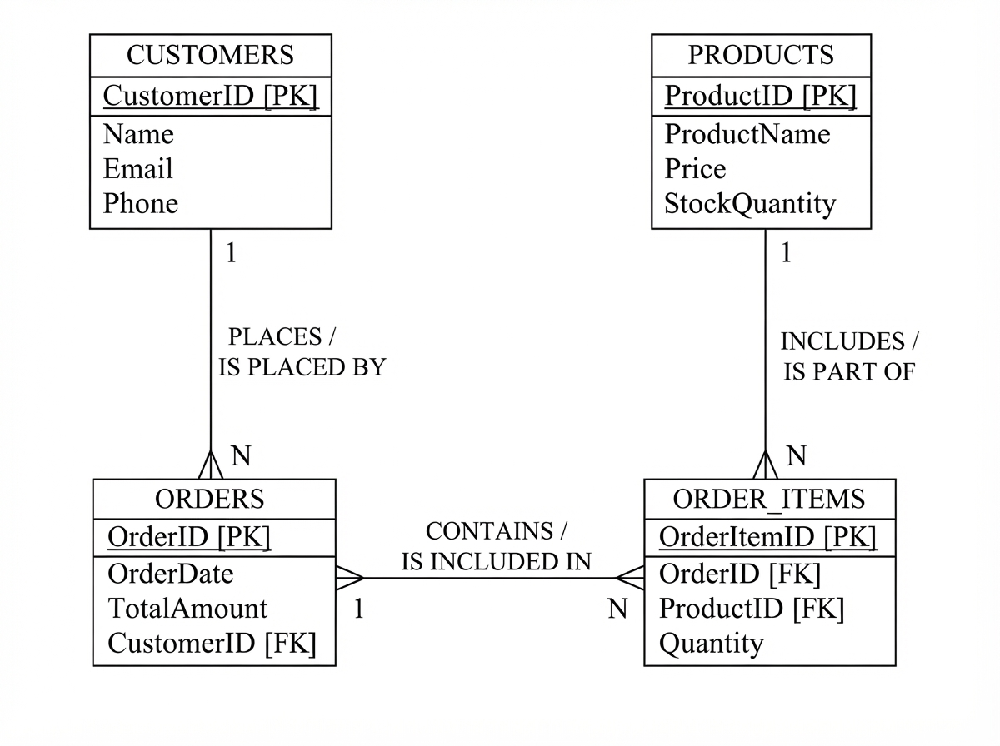

# 📄 DocuForge AI

<div align="center">



**Intelligent Academic & Software Engineering Project Documentation Generator**

An all-in-one platform to plan, structure, generate, and export comprehensive, university- and IEEE-compliant software project documentation, complete with UML diagrams, database schemas, test cases, and editable Microsoft Word (`.docx`) exports.

[](https://react.dev/)
[](https://www.typescriptlang.org/)
[](https://vitejs.dev/)
[](https://tailwindcss.com/)
[](LICENSE)
[](https://github.com/PrincePanara/cerateprojectdoc/pulls)

[Features](#-key-features) • [Report Structure](#-report-structure) • [Tech Stack](#-tech-stack) • [Quick Start](#-quick-start) • [Project Architecture](#-project-architecture) • [Export Capabilities](#-export-capabilities)

</div>

---

## 🌟 Overview

Writing comprehensive documentation for academic final-year projects, capstone submissions, or enterprise software proposals is notoriously tedious. Formatting guidelines (margins, font hierarchies, tables of contents, certificates, and test case tables) consume valuable engineering hours.

**DocuForge AI** solves this by providing a guided, 11-step interactive wizard that models your software project end-to-end. It assists with AI-powered prose generation, offers a pixel-perfect live A4 paginated preview, and exports a production-ready, fully styled Microsoft Word document (`.docx`), as well as Markdown and JSON.

---

## ✨ Key Features

### 🧙‍♂️ 11-Step Interactive Project Wizard
- **1. Basic Information**: Project title, subtitle, academic year, semester, student details, enrollment numbers, college/university credentials, project guide name, and college emblem/logo.
- **2. Problem & Objectives**: Formal problem statement, project motivation, SMART objectives, project scope, and target audience personas.
- **3. Requirements Engineering**: Granular Functional Requirements (FR) with priority matrix (High/Medium/Low) and module associations, alongside Non-Functional Requirements (NFR) spanning security, scalability, performance, and reliability.
- **4. Technology Stack**: Structured catalog of languages, frontend frameworks, backend runtimes, databases, and DevOps tools with specified versions and architectural purposes.
- **5. System Architecture & Diagrams**: Multi-diagram support with custom image uploads and captions for:
  - System Architecture
  - Data Flow Diagrams (DFD)
  - Entity-Relationship (ER) Diagrams
  - Use Case & Sequence Diagrams
  - Workflow & Activity Diagrams
- **6. Modules Breakdown**: Modular decomposition detailing role permissions, inputs, computational outputs, and inter-module dependencies.
- **7. Database Design & Data Dictionary**: Detailed database schema builder with tables, column datatypes, primary/foreign keys, nullability, constraints, and relational mappings.
- **8. Testing & Quality Assurance**: Test strategy planning and structured test case tables including Test ID, Module, Scenario, Input, Expected Result, Actual Result, and Execution Status (`Pass` | `Fail` | `Blocked` | `Not Run`).
- **9. Screenshots Library**: Visual documentation gallery mapping UI screenshots to modules with annotated captions and functional notes.
- **10. AI Documentation Engine**: Automated AI prose generation for technical background, methodology, discussion of results, and future enhancements.
- **11. Preview & Multi-Format Export**: Instant generation and download of formatted `.docx`, Markdown, and print stylesheets.

---

### 📄 Production-Grade DOCX Generation
- Emits real, fully editable Microsoft Word documents using the `docx` OpenXML library.
- Built-in university-standard sections: Cover Page, Certificate of Authenticity, Student Declaration, Acknowledgments, Table of Contents, and List of Figures.
- Formatted tables with shaded headers for requirements, database schemas, and test cases.
- Automatic page numbering and customizable headers/footers.

---

### 👁️ Real-Time A4 Paginated Live Preview
- Inspect pages in realistic A4 sheets with visual page margins and sheet breaks before exporting.
- Interactive formatting controls:
  - **Fonts**: Times New Roman, Arial, Calibri, Georgia
  - **Line Spacing**: 1.0, 1.15, 1.5, 2.0
  - **Heading & Body Scale**: Independent sizing for H1, H2, H3, and body text
  - **Margins**: Normal (1 inch), Narrow, or Wide
  - **Page Number Positions**: Bottom-Center, Bottom-Right, Top-Right, or None

---

### 🎨 Templates & Theme Engine
- **Pre-Configured Templates**:
  - `Academic Classic`: Traditional serif layout conforming to strict university guidelines.
  - `Modern Academic`: Clean, contemporary sans-serif design for modern symposiums and engineering reviews.
  - `Professional Software`: Executive format tailored for corporate and enterprise delivery.
  - `Minimalist`: Lightweight, clean formatting highlighting code and data tables.
- **Dark & Light Mode**: Fluid theme toggle with persistent state and accessible contrast tokens.

---

### 📊 Project Readiness Score & Autosave
- Real-time completeness score calculated across all 11 sections.
- Visual readiness indicators showing which chapters need additional details.
- Autosave to `localStorage` with version snapshots to prevent accidental data loss.

---

## 📑 Generated Document Structure

A standard generated report incorporates the following chapters in sequence:

```
├── 🎓 Front Matter
│   ├── Cover Page (Project Title, Subtitle, Students, Guide, Logo)
│   ├── Certificate of Completion
│   ├── Student Declaration
│   ├── Acknowledgements
│   ├── Abstract & Executive Summary
│   ├── Table of Contents
│   └── List of Figures & Tables
├── 📖 Core Chapters
│   ├── Chapter 1: Introduction & Problem Statement
│   ├── Chapter 2: System Analysis & Requirements (FR & NFR)
│   ├── Chapter 3: System Architecture & Design Diagrams
│   ├── Chapter 4: Technology Stack & Environment
│   ├── Chapter 5: System Modules & Functional Flow
│   ├── Chapter 6: User Interface & Screenshots
│   ├── Chapter 7: Database Design & Data Dictionary
│   ├── Chapter 8: Software Testing & Test Cases
│   ├── Chapter 9: Results & Discussion
│   └── Chapter 10: Conclusion & Future Scope
└── 📚 End Matter
    └── References & Bibliography (IEEE / APA)
```

---

## 🛠️ Tech Stack

| Layer | Technology | Purpose |
| :--- | :--- | :--- |
| **Frontend Framework** | [React 18.3](https://react.dev/) | Component architecture & declarative state rendering |
| **Build Tool** | [Vite 5.2](https://vitejs.dev/) | Rapid development server and optimized bundle build |
| **Language** | [TypeScript 5.5](https://www.typescriptlang.org/) | Strict static typing and reliable domain modeling |
| **Styling** | [Tailwind CSS 3.4](https://tailwindcss.com/) | Utility-first, themeable design system |
| **Icons** | [Lucide React](https://lucide.dev/) | Clean, accessible SVG iconography |
| **Animations** | [Framer Motion 11](https://www.framer.com/motion/) | Smooth UI transitions and wizard micro-animations |
| **Docx Engine** | [docx](https://docx.js.org/) | Programmatic Microsoft Word (.docx) file construction |
| **Date Utilities** | [date-fns](https://date-fns.org/) | Academic dates, timestamps, and version formatting |

---

## 🚀 Quick Start

### Prerequisites
- **Node.js**: `v18.0.0` or higher
- **npm**: `v9.0.0` or higher (or `pnpm` / `yarn`)

### Installation

1. **Clone the repository**:
   ```bash
   git clone https://github.com/PrincePanara/cerateprojectdoc.git
   cd cerateprojectdoc
   ```

2. **Install project dependencies**:
   ```bash
   npm install
   ```

3. **Start the local development server**:
   ```bash
   npm run dev
   ```

4. **Access the application**:
   Open your browser and navigate to `http://localhost:5173` (or the port displayed in your terminal, e.g. `http://localhost:5179`).

---

## 💻 Available Scripts

In the project directory, you can run:

| Command | Action |
| :--- | :--- |
| `npm run dev` | Starts Vite dev server with hot module replacement (HMR) |
| `npm run build` | Compiles TypeScript and builds production bundles to `dist/` |
| `npm run preview` | Runs a local static web server to preview the production build |
| `npm run lint` | Runs ESLint to identify code issues and style violations |

---

## 📁 Project Architecture

```
DOCG/
├── public/                    # Static assets, fallback emblems, demo screenshots
├── src/
│   ├── components/            # Reusable UI & domain-specific components
│   │   ├── brand/             # Logo & branding elements
│   │   ├── document/          # Paginated A4 preview & live formatting panel
│   │   ├── landing/           # Interactive landing page mocks & showcases
│   │   ├── layout/            # App shell, navigation header, authentication guards
│   │   ├── projects/          # Project dashboard cards, creation modals
│   │   ├── ui/                # Buttons, inputs, modals, toasts, progress bars
│   │   └── wizard/            # 11-step wizard controller and sub-step views
│   │       ├── steps/         # Individual step components (Architecture, DB, etc.)
│   │       └── StepNav.tsx    # Responsive stepper navigation
│   ├── contexts/              # Global state providers
│   │   ├── AuthContext.tsx    # User session & profile management
│   │   ├── ProjectsContext.tsx# Active projects, CRUD operations, auto-save
│   │   └── ThemeContext.tsx   # Dark / Light theme toggle & tokens
│   ├── data/                  # Template definitions, sample projects, catalogs
│   │   ├── catalogs.ts        # Pre-built tech stacks, diagram types, templates
│   │   ├── emptyProject.ts    # Blank project schema template
│   │   ├── landing.ts         # Landing page marketing & feature data
│   │   └── sampleProject.ts   # Comprehensive sample data (DocuForge demo)
│   ├── pages/                 # Route page views
│   │   ├── Auth.tsx           # Authentication & sign-in page
│   │   ├── Builder.tsx        # Standalone document builder interface
│   │   ├── Dashboard.tsx      # Main project overview & analytics
│   │   ├── DiagramsLibrary.tsx# Diagram assets repository
│   │   ├── Help.tsx           # Documentation & FAQs
│   │   ├── Landing.tsx        # Product landing page
│   │   ├── ProjectWizard.tsx  # Interactive step-by-step editor
│   │   ├── Projects.tsx       # Saved projects list & management
│   │   ├── ScreenshotsLibrary.tsx# Project screenshot repository
│   │   ├── Settings.tsx       # Preferences & template configurations
│   │   └── Templates.tsx      # Template gallery & preview
│   ├── types/                 # TypeScript interfaces & types
│   │   └── project.ts         # Comprehensive schema models (Project, Module, TestCase, etc.)
│   ├── utils/                 # Business logic & export helpers
│   │   ├── ai.ts              # AI prompt templates & prose generators
│   │   ├── cn.ts              # Tailwind class merging utility
│   │   ├── documentModel.ts   # Document node tree transformer
│   │   ├── docxBuilder.ts     # OpenXML Word document builder
│   │   ├── otherExports.ts    # Markdown, JSON, and text export handlers
│   │   ├── stepStatus.ts      # Section readiness & validation logic
│   │   └── validation.ts      # Input validation & schema guards
│   ├── App.tsx                # Client routing & layout assembly
│   ├── index.css              # Global styles, Tailwind base, and typography
│   └── index.tsx              # React entry root
├── .eslintrc.cjs              # ESLint configuration
├── .gitignore                 # Git ignore rules
├── index.html                 # HTML document template
├── package.json               # Dependencies and scripts
├── postcss.config.js          # PostCSS configuration
├── tailwind.config.js         # Tailwind theme extension & color tokens
├── tsconfig.json              # TypeScript configuration
└── vite.config.ts             # Vite build configuration
```

---

## 📥 Export Capabilities

- **Microsoft Word (`.docx`)**: Generated natively using [docx](https://github.com/dolanmiu/docx). Includes headers, footers, cover page, styled tables with auto-width, bulleted requirements, and embedded images.
- **Markdown (`.md`)**: Complete report formatted in clean GitHub-Flavored Markdown for version control and documentation hosting.
- **JSON Format (`.json`)**: Raw structured project model for backups, portability, and programmatic integration.
- **Browser Print / PDF**: Formatted CSS print stylesheets for browser-native Save to PDF.

---

## 🤝 Contributing

Contributions, issues, and feature requests are welcome!

1. Fork the Project
2. Create your Feature Branch (`git checkout -b feature/AmazingFeature`)
3. Commit your Changes (`git commit -m 'Add some AmazingFeature'`)
4. Push to the Branch (`git push origin feature/AmazingFeature`)
5. Open a Pull Request

---

## 📝 License

Distributed under the **MIT License**. See `LICENSE` for more information.

---

<div align="center">

Made with ❤️ by [Prince Panara](https://github.com/PrincePanara)

</div>
